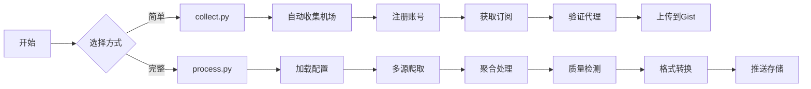

# Aggregator - 免费代理池构建工具

[](https://github.com/wzdnzd/aggregator/stargazers)
[](https://github.com/wzdnzd/aggregator/network)
[](https://github.com/wzdnzd/aggregator/issues)
[](https://github.com/wzdnzd/aggregator/blob/main/LICENSE)
[](https://ghcr.io/wzdnzd/aggregator)

## 🎯 项目简介

一个强大的免费代理池构建工具，通过爬取多个平台/网页的代理资源，自动验证、聚合并转换为各种客户端所需格式。新版本增加了精细化插件管理系统，可精确控制每个插件的启用/禁用和定时执行。

### ✨ 核心特性

- **🕷️ 多源爬取** - Telegram、GitHub、Google、Yandex、Twitter 等
- **🔍 智能验证** - 自动检测代理活性和质量
- **🔄 格式转换** - 支持 Clash、V2Ray、SingBox 等格式
- **💾 灵活存储** - GitHub Gist、PasteGG、Imperial 等多种后端
- **🔌 插件系统** - 可扩展的自定义爬取架构
- **⚡ 高效处理** - 多线程并发，批量处理
- **⚙️ 精细化管理** - 精确控制每个插件的启用/禁用和定时执行
- **🐳 容器化部署** - 支持Docker及自动构建发布

### 🌐 支持协议
VMess | Trojan | SS | SSR | Snell | Hysteria2 | VLESS | Hysteria | TUIC | AnyTLS | HTTP | SOCKS

## 🚀 快速开始

### 新增功能说明

#### 1. 配置验证
- 系统现在支持配置验证功能，确保配置格式正确
- 插件配置和系统配置都经过验证后才保存

#### 2. API缓存机制
- 关键API端点（插件列表、系统状态）启用了缓存机制
- 提高API响应速度，减少重复计算
- 缓存超时时间：30秒

#### 3. API限流机制
- 登录端点限制：5分钟内最多5次尝试
- 默认端点限制：1分钟内最多100次请求
- 防止恶意请求和暴力破解

#### 4. 插件生成器工具
- 快速生成插件模板和配置
- 简化插件开发流程
- 一键创建插件脚本和配置

#### 5. 优化的状态跟踪
- 精确跟踪运行中的插件
- 准确显示系统运行状态
- 改进的UI状态显示

### 使用方式

### 两种使用方式

#### 方式一：process.py（推荐）
**完整功能版本** - 支持复杂配置、多源爬取、自定义规则

```bash
# 1. 准备配置文件
cp subscribe/config/config.default.json my-config.json

# 2. 设置环境变量
export PUSH_TOKEN=your_github_token

# 3. 运行处理
python subscribe/process.py -s my-config.json
```

#### 方式二：collect.py
**简化版本** - 快速收集机场订阅

```bash
# 直接运行，自动收集并上传到 Gist
python subscribe/collect.py \
    -g username/gist-id \
    -k your-github-token \
    -t clash v2ray singbox
```

### 🎁 共享订阅
> 可前往 [Issue #91](https://github.com/wzdnzd/aggregator/issues/91) 获取现成的**共享订阅**，量大质优。**请勿浪费**

## 🔌 插件开发与管理系统

### 精细化插件管理系统
新版本支持精细化插件管理，可精确控制每个插件的启用/禁用和定时执行。

### Web UI 界面

该项目提供了一个现代化的 Web 界面，让您可以通过图形化界面轻松管理插件和配置。

### 身份验证

系统包含安全的身份验证功能，需要登录后才能访问管理界面。默认凭据为 admin/admin123。

#### 系统概述
精细化插件管理系统允许您精确控制每个插件的启用/禁用和定时执行。系统采用模块化设计，支持插件热加载和动态管理。

#### 目录结构
```
aggregator/
├── plugin_manager/           # 插件管理器
│   ├── __init__.py
│   └── manager.py
├── plugins/                  # 插件目录
│   ├── __init__.py
│   ├── exercises/            # 练习题插件
│   │   ├── __init__.py
│   │   └── math_exercises.py
│   ├── news/                 # 新闻插件
│   │   └── __init__.py
│   └── custom_plugins/       # 自定义插件
│       ├── __init__.py
│       └── my_plugin.py
├── config/
│   ├── plugin_config.json    # 插件配置文件
│   └── plugin_config_template.json  # 插件配置模板
├── plugin_control.py         # 插件控制脚本
└── main_executor.py          # 主执行器
```

#### 基础操作

##### 查看所有插件状态
```bash
python plugin_control.py list
```

##### 启用插件
```bash
python plugin_control.py enable plugin_name
```

##### 禁用插件
```bash
python plugin_control.py disable plugin_name
```

##### 运行插件
```bash
python plugin_control.py run plugin_name
```

##### 查看插件状态
```bash
python plugin_control.py status plugin_name
```

#### 配置文件详解
插件配置文件位于 `config/plugin_config.json`：

```json
{
  "plugins": {
    "plugin_name": {
      "module_path": "plugins.exercises.math_exercises",  // 插件模块路径
      "function_name": "crawl_math_exercises",           // 插件函数名
      "enabled": true,                                   // 启用状态
      "cron_schedule": "0 2 * * *",                     // 定时执行配置
      "parameters": {                                   // 插件参数
        "base_url": "https://example.com",
        "grade": "3",
        "subject": "math"
      },
      "timeout": 300,                                    // 超时时间（秒）
      "max_retries": 3                                   // 最大重试次数
    }
  }
}
```

#### 自定义插件开发指南

##### 1. 插件开发基础
每个插件必须包含一个函数，该函数接受一个参数字典并返回结果。

##### 2. 创建自定义插件

**步骤 1：创建插件文件**

在 `plugins/custom_plugins/` 目录下创建新的插件文件：

```python
# plugins/custom_plugins/my_custom_plugin.py
import sys
import os
import requests
from urllib.parse import urljoin
import time

# 添加项目路径到Python环境
sys.path.append('/aggregator')

from subscribe.logger import logger


def my_custom_function(params: dict):
    """
    自定义插件函数
    
    Args:
        params: 插件参数字典
        
    Returns:
        插件执行结果，通常是一个列表，包含要处理的数据
    """
    # 记录插件开始执行
    logger.info(f"[MyCustomPlugin] 开始执行自定义插件，参数: {params}")
    
    # 从参数中获取配置
    base_url = params.get("base_url", "https://example.com")
    timeout = params.get("timeout", 30)
    
    try:
        # 执行自定义逻辑
        response = requests.get(base_url, timeout=timeout)
        response.raise_for_status()
        
        # 处理响应数据
        data = response.json() if response.headers.get('content-type', '').startswith('application/json') else response.text
        
        # 构造返回结果
        result = {
            "status": "success",
            "message": "自定义插件执行成功",
            "timestamp": int(time.time()),
            "data": data,
            "params": params
        }
        
        logger.info(f"[MyCustomPlugin] 插件执行完成，结果: {result}")
        return result
        
    except requests.exceptions.RequestException as e:
        error_result = {
            "status": "error",
            "message": f"请求失败: {str(e)}",
            "timestamp": int(time.time()),
            "params": params
        }
        logger.error(f"[MyCustomPlugin] 插件执行失败: {error_result}")
        return error_result
    except Exception as e:
        error_result = {
            "status": "error",
            "message": f"插件执行异常: {str(e)}",
            "timestamp": int(time.time()),
            "params": params
        }
        logger.error(f"[MyCustomPlugin] 插件执行异常: {error_result}")
        return error_result
```

**步骤 2：在配置文件中添加插件配置**

在 `config/plugin_config.json` 中添加新插件配置：

```json
{
  "plugins": {
    "my_custom_plugin": {
      "module_path": "plugins.custom_plugins.my_custom_plugin",
      "function_name": "my_custom_function",
      "enabled": false,
      "cron_schedule": "0 4 * * *",
      "parameters": {
        "base_url": "https://api.example.com/data",
        "timeout": 30
      },
      "timeout": 300,
      "max_retries": 3
    }
  }
}
```

##### 3. 插件开发最佳实践

**插件函数要求：**
- 函数必须接受一个 `params: dict` 参数
- 函数必须返回一个结果（通常是字典或列表）
- 使用项目提供的 `logger` 记录日志
- 处理异常情况并返回适当的错误信息

**返回值格式：**
- 通常返回包含 `status` 字段的字典
- 可以返回数据列表用于进一步处理
- 错误情况下返回错误信息

**插件类型示例：**

**A. 数据抓取插件**
```python
def crawl_data_plugin(params: dict):
    """数据抓取插件示例"""
    import requests
    from subscribe.logger import logger
    
    url = params.get("url", "")
    headers = params.get("headers", {})
    
    try:
        response = requests.get(url, headers=headers)
        # 处理数据并返回
        return [{"title": "抓取的数据", "url": url, "content": response.text}]
    except Exception as e:
        logger.error(f"抓取失败: {e}")
        return []
```

**B. 数据处理插件**
```python
def process_data_plugin(params: dict):
    """数据处理插件示例"""
    from subscribe.logger import logger
    
    input_data = params.get("input_data", [])
    # 处理数据
    processed_data = [item for item in input_data if item.get("valid", True)]
    logger.info(f"处理了 {len(processed_data)} 项数据")
    return processed_data
```

**C. 存储插件**
```python
def store_data_plugin(params: dict):
    """存储插件示例"""
    import json
    from subscribe.logger import logger
    
    data = params.get("data", [])
    output_path = params.get("output_path", "/aggregator/data/output.json")
    
    try:
        with open(output_path, 'w', encoding='utf-8') as f:
            json.dump(data, f, ensure_ascii=False, indent=2)
        logger.info(f"数据已保存到 {output_path}")
        return {"status": "success", "path": output_path, "count": len(data)}
    except Exception as e:
        logger.error(f"保存失败: {e}")
        return {"status": "error", "message": str(e)}
```

##### 4. 配置文件参数详解

**plugin_config.json 参数说明：**

| 参数名 | 类型 | 必需 | 说明 |
|--------|------|------|------|
| `module_path` | string | 是 | 插件模块的Python导入路径，如 `plugins.exercises.math_exercises` |
| `function_name` | string | 是 | 插件执行函数的名称 |
| `enabled` | boolean | 是 | 插件启用状态，true为启用，false为禁用 |
| `cron_schedule` | string | 否 | 定时执行配置（cron表达式格式），默认不设置 |
| `parameters` | object | 否 | 传递给插件的参数字典 |
| `timeout` | integer | 否 | 插件执行超时时间（秒），默认300秒 |
| `max_retries` | integer | 否 | 最大重试次数，默认3次 |

**cron表达式格式：**
```
* * * * * 代表：分钟 小时 日 月 星期

常见示例：
"0 2 * * *"        # 每天凌晨2点执行
"*/30 * * * *"      # 每30分钟执行一次
"0 0 * * 0"         # 每周日凌晨执行
"0 */6 * * *"       # 每6小时执行一次
"30 10 * * 1-5"     # 每周一到周五上午10:30执行
```

##### 5. 插件开发流程

**步骤 1：规划插件功能**
- 确定插件的用途和功能
- 设计参数结构
- 确定返回值格式

**步骤 2：创建插件文件**
- 在相应插件目录创建文件
- 实现插件函数
- 添加错误处理和日志记录

**步骤 3：配置插件**
- 在 `plugin_config.json` 中添加配置
- 设置适当的参数和调度

**步骤 4：测试插件**
- 使用 `python plugin_control.py run plugin_name` 测试
- 检查日志输出
- 验证功能正确性

**步骤 5：启用插件**
- 使用 `python plugin_control.py enable plugin_name` 启用
- 或直接在配置文件中设置 `"enabled": true`

##### 6. 插件调试技巧

**调试方法：**
1. 使用 `plugin_control.py run` 命令单独测试插件
2. 查看日志输出以了解执行过程
3. 在插件代码中添加调试日志
4. 检查参数传递是否正确

**常见问题：**
- 模块路径错误：检查 `module_path` 是否正确
- 函数名错误：确认 `function_name` 与实际函数名一致
- 参数错误：验证 `parameters` 格式和内容
- 依赖问题：确保插件所需依赖已安装

#### 插件配置管理

##### 1. 配置文件结构
`config/plugin_config.json` 是插件系统的中央配置文件，定义了所有插件的配置。

##### 2. 配置文件管理
- 可以在运行时修改配置文件
- 插件系统会自动加载新的配置
- 修改后可通过控制脚本验证

##### 3. 配置模板参考
我们提供了 `plugin_config_template.json` 文件作为配置模板，包含各种常见插件类型的示例配置，您可以根据需要进行修改和定制。

##### 4. 快速开始插件开发
参考 `PLUGIN_QUICK_START.md` 文件，其中包含了：
- Hello World 插件示例
- 常用插件模板
- 配置参数详解
- 常用cron表达式
- 调试技巧

##### 5. 批量配置管理
可以同时管理多个插件的配置：
```bash
# 启用多个插件
python plugin_control.py enable plugin1 plugin2 plugin3

# 查看多个插件状态
python plugin_control.py status plugin1 plugin2 plugin3
```

## 📦 Docker 部署

### 镜像获取

项目镜像已发布到 GitHub Container Registry，您可以直接拉取使用：

```bash
# 拉取最新镜像
docker pull ghcr.io/yuanzhou029/aggregatorv2.0:latest
```

### 环境变量配置

运行容器前，需要配置以下环境变量：

| 变量名 | 说明 | 是否必需 | 示例值 |
|--------|------|----------|--------|
| `GIST_PAT` | GitHub Personal Access Token | 是 | `ghp_xxxxxxxxxxxxxx` |
| `GIST_LINK` | Gist ID（格式：用户名/gist_id） | 是 | `username/abc123def456` |
| `CUSTOMIZE_LINK` | 自定义机场列表 URL | 否 | `https://example.com/list` |
| `TZ` | 时区 | 否 | `Asia/Shanghai` |

**获取 GitHub Token**：
1. 访问 GitHub → Settings → Developer settings → Personal access tokens
2. 生成新 Token，选择 `gist` 权限
3. 复制生成的 Token

**获取 Gist ID**：
1. 访问 https://gist.github.com/
2. 创建或选择一个 Gist
3. 复制 URL 中的 ID 部分

### 运行方式

#### 方式一：单容器运行

```bash
# 创建必要的目录
mkdir -p ./aggregator/{data,config,plugins}

# 运行容器（请将示例值替换为您的实际值）
docker run -d \
  --name aggregator \
  --restart unless-stopped \
  -e GIST_PAT=your_github_token_here \
  -e GIST_LINK=your_username/your_gist_id_here \
  -e CUSTOMIZE_LINK=your_customize_link_here \
  -e TZ=Asia/Shanghai \
  -v $(pwd)/aggregator/data:/aggregator/data \
  -v $(pwd)/aggregator/config:/aggregator/config \
  -v $(pwd)/aggregator/plugins:/aggregator/plugins \
  ghcr.io/yuanzhou029/aggregatorv2.0:latest
```

#### 方式二：Docker Compose（推荐）

创建 `docker-compose.yml` 文件：

```yaml
version: '3.8'

services:
  aggregator:
    image: ghcr.io/yuanzhou029/aggregatorv2.0:latest
    container_name: aggregator
    environment:
      # 必需环境变量 - 请替换为您的实际值
      - GIST_PAT=your_github_token_here
      - GIST_LINK=your_username/your_gist_id_here
      # 可选环境变量
      - CUSTOMIZE_LINK=your_customize_link_here
      - TZ=Asia/Shanghai
    volumes:
      # 数据持久化挂载
      - ./data:/aggregator/data
      - ./config:/aggregator/config
      - ./plugins:/aggregator/plugins
      - ./plugin_manager:/aggregator/plugin_manager
    restart: unless-stopped
    command: [
      "python", 
      "-u", 
      "main_executor.py"
    ]
```

创建目录并启动服务：

```bash
# 创建必要的目录
mkdir -p ./data ./config ./plugins ./plugin_manager

# 启动服务
docker-compose up -d

# 查看服务状态
docker-compose ps

# 查看日志
docker-compose logs -f
```

### 验证部署

```bash
# 检查容器是否正在运行
docker ps

# 查看容器日志
docker logs aggregator

# 进入容器检查
docker exec -it aggregator bash
```

### 插件系统管理

容器运行后，可以使用插件控制脚本管理插件：

```bash
# 进入容器
docker exec -it aggregator bash

# 查看所有插件状态
python plugin_control.py list

# 启用插件
python plugin_control.py enable plugin_name

# 禁用插件
python plugin_control.py disable plugin_name

# 运行插件
python plugin_control.py run plugin_name

# 查看插件状态
python plugin_control.py status plugin_name
```

### 维护命令

```bash
# 查看实时日志
docker logs -f aggregator

# 重启容器
docker restart aggregator

# 停止容器
docker stop aggregator

# 启动已停止的容器
docker start aggregator

# 更新镜像
docker pull ghcr.io/yuanzhou029/aggregatorv2.0:latest
```

### 故障排除

1. **容器无法启动**：检查环境变量是否正确设置
2. **GitHub Token 无效**：确认 Token 具有 `gist` 权限且未过期
3. **插件不执行**：检查 `config/plugin_config.json` 中插件是否启用

如遇问题，请查看容器日志：`docker logs aggregator`

## 🚀 GitHub自动构建发布

本项目支持使用GitHub Actions自动构建Docker镜像并发布到GitHub Container Registry (ghcr.io)。

### 部署到GitHub

1. **创建GitHub仓库**
   - 登录GitHub并创建新仓库
   - 将本地代码推送至GitHub

2. **启用Package功能**
   - 确保仓库设置允许packages

3. **自动构建触发**
   - 推送代码到main/master分支时自动构建
   - 发布release时自动构建带标签的镜像

### GitHub Actions工作流

项目包含两个工作流：

1. **自动构建** (.github/workflows/docker.yml)
   - 触发条件：推送到main/master分支或PR
   - 构建平台：linux/amd64, linux/arm64
   - 镜像标签：分支名、SHA、latest

2. **发布构建** (.github/workflows/publish-docker.yml)
   - 触发条件：创建新Release
   - 构建平台：linux/amd64
   - 镜像标签：Release标签

### 使用方法

1. **推送代码到GitHub**
```bash
git init
git add .
git commit -m "Initial commit"
git remote add origin https://github.com/你的用户名/你的仓库名.git
git branch -M main
git push -u origin main
```

2. **创建Release以构建带标签的镜像**
   - 在GitHub仓库页面点击"Releases"
   - 点击"Draft a new release"
   - 设置标签（如v1.0.0）并发布

## 📊 工作流程



## ⚡ 快速配置

### 最小配置示例

**process.py 配置**：
```json
{
    "domains": [
        {
            "name": "example-airport",
            "domain": "example.com",
            "push_to": ["free"]
        }
    ],
    "crawl": {
        "enable": true,
        "telegram": {
            "enable": true,
            "users": {
                "proxy_channel": {
                    "push_to": ["free"]
                }
            }
        }
    },
    "groups": {
        "free": {
            "targets": {"clash": "free-clash"}
        }
    },
    "storage": {
        "engine": "gist",
        "items": {
            "free-clash": {
                "username": "your-username",
                "gistid": "your-gist-id", 
                "filename": "clash.yaml"
            }
        }
    }
}
```

**环境变量**：
```bash
export PUSH_TOKEN=your_github_token
```

### 常用命令

```bash
# 快速收集（推荐新手）
python subscribe/collect.py -g username/gist-id -k token

# 完整处理（推荐进阶）
python subscribe/process.py -s config.json

# 仅检查代理活性
python subscribe/process.py -s config.json --check

# 高性能模式
python subscribe/process.py -s config.json -n 128
```


## 📚 相关文档

| 文档                         | 说明            | 适用人群            |
| ---------------------------- | --------------- | ------------------- |
| [完整文档](README_CN.md)     | 详细配置说明    | 进阶用户            |
| [English Docs](README_EN.md) | English version | International users |
| [插件开发指南](PLUGIN_DEVELOPMENT_GUIDE.md) | 插件开发详细说明 | 插件开发者          |
| [插件快速入门](PLUGIN_QUICK_START.md) | 插件开发快速入门 | 插件开发者          |
| [配置模板](plugin_config_template.json) | 插件配置示例 | 插件开发者          |
| [Docker部署指南](DOCKER_DEPLOYMENT_GUIDE.md) | Docker部署详细说明 | 部署运维人员        |
| [Web UI使用指南](WEB_UI_GUIDE.md) | Web UI界面使用说明 | 所有用户            |
| [安全配置指南](SECURITY_GUIDE.md) | 系统安全配置说明 | 系统管理员          |
| [Docker一键安装](DOCKER_INSTALL_GUIDE.md) | Docker一键安装部署指南 | 所有用户            |
| [本地运行指南](LOCAL_RUN_GUIDE.md) | 本地开发运行说明 | 开发者            |

## 🔧 常见问题

| 问题         | 解决方案                                   |
| ------------ | ------------------------------------------ |
| 配置文件错误 | `python -m json.tool config.json` 验证语法 |
| Token 无效   | 检查 GitHub Token 权限和有效期             |
| 网络超时     | 增加超时 `-t 15000` 或减少线程 `-n 16`     |
| 无代理输出   | 检查爬取源配置和网络连接                   |

## 🚧 TODO 路线图

### 架构重构
- [ ] **核心接口设计** - 抽象出 `ICrawler`、`IStorage`、`IConverter` 等核心接口
- [ ] **基类实现** - 创建 `BaseCrawler`、`BaseStorage`、`BaseConverter` 抽象基类
- [ ] **具体实现重构** - 将现有爬虫、存储、转换模块改为继承基类并实现接口
- [ ] **工厂模式** - 使用工厂模式动态创建爬虫和存储实例，提升扩展性
- [ ] **模块解耦** - 通过接口依赖替代直接依赖，降低模块间耦合度

### 插件化架构
- [ ] **爬虫插件化** - 将 Telegram、GitHub、Google 等爬虫重构为独立插件
- [ ] **存储插件化** - 将 Gist、PasteGG、Imperial 等存储后端重构为插件
- [ ] **插件注册机制** - 实现插件自动发现和注册系统
- [ ] **插件配置标准化** - 定义统一的插件配置规范和验证机制

### 配置系统优化
- [ ] **配置模型化** - 使用 Pydantic 定义强类型配置模型
- [ ] **配置验证增强** - 实现配置完整性检查和错误提示
- [ ] **配置模板化** - 提供常用场景的配置模板和生成工具
- [ ] **配置文档化** - 自动生成配置项说明文档

### 代码质量提升
- [ ] **类型系统完善** - 全面引入类型注解，提升 IDE 支持和代码安全性
- [ ] **异常体系重构** - 设计统一的异常层次结构和错误码系统
- [ ] **日志标准化** - 实现结构化日志和统一的日志格式
- [ ] **代码风格统一** - 集成 Black、isort、flake8 等工具链

### 性能与稳定性
- [ ] **并发模型优化** - 改进线程池管理和任务调度机制
- [ ] **资源管理** - 实现连接池和资源自动回收机制
- [ ] **容错能力增强** - 完善重试策略和降级处理逻辑
- [ ] **内存优化** - 优化大数据处理的内存使用效率

---

## ⚖️ 免责声明

+ 本项目仅用作学习爬虫技术，请勿滥用，不要通过此工具做任何违法乱纪或有损国家利益之事
+ 禁止使用该项目进行任何盈利活动，对一切非法使用所产生的后果，本人概不负责
+ 使用者应遵守当地法律法规，尊重网站服务条款，合理使用网络资源

## 🙏 致谢

### 核心依赖
- [Subconverter](https://github.com/asdlokj1qpi233/subconverter) - 订阅转换核心
- [Mihomo](https://github.com/MetaCubeX/mihomo) - 代理测试引擎

### 赞助支持
感谢以下组织的赞助支持：
- [](https://yxvm.com)
- [NodeSupport](https://github.com/NodeSeekDev/NodeSupport)

### 社区贡献
感谢所有为项目贡献代码、提出建议和报告问题的开发者们！

<div align="center">

**如果这个项目对你有帮助，请给它一个 ⭐**

[报告问题](https://github.com/wzdnzd/aggregator/issues) · [功能请求](https://github.com/wzdnzd/aggregator/issues) · [贡献代码](https://github.com/wzdnzd/aggregator/pulls)

</div>