# Aggregator - 免费代理池构建工具

[](https://github.com/wzdnzd/aggregator/stargazers)
[](https://github.com/wzdnzd/aggregator/network)
[](https://github.com/wzdnzd/aggregator/issues)
[](https://github.com/wzdnzd/aggregator/blob/main/LICENSE)

## 🎯 项目简介

一个强大的免费代理池构建工具，通过爬取多个平台/网页的代理资源，自动验证、聚合并转换为各种客户端所需格式。新版本增加了精细化插件管理系统，可精确控制每个插件的启用/禁用和定时执行。

### ✨ 核心特性

- **🕷️ 多源爬取** - Telegram、GitHub、Google、Yandex、Twitter 等
- **🔍 智能验证** - 自动检测代理活性和质量
- **🔄 格式转换** - 支持 Clash、V2Ray、SingBox 等格式
- **💾 灵活存储** - GitHub Gist、PasteGG、Imperial 等多种后端
- **🔌 插件系统** - 可扩展的自定义爬取架构
- **⚡ 高效处理** - 多线程并发，批量处理
- **⚙️ 精细化管理** - 精确控制每个插件的启用/禁用和定时执行

### 🌐 支持协议
VMess | Trojan | SS | SSR | Snell | Hysteria2 | VLESS | Hysteria | TUIC | AnyTLS | HTTP | SOCKS

## 🚀 两种使用方式

### 方式一：process.py（推荐）
**完整功能版本** - 支持复杂配置、多源爬取、自定义规则

```bash
# 1. 准备配置文件
cp subscribe/config/config.default.json my-config.json

# 2. 设置环境变量
export PUSH_TOKEN=your_github_token

# 3. 运行处理
python subscribe/process.py -s my-config.json
```

**适用场景**：
- 需要精细控制爬取规则
- 多分组输出管理
- 自定义存储后端
- 定时自动化运行

### 方式二：collect.py
**简化版本** - 快速收集机场订阅

```bash
# 直接运行，自动收集并上传到 Gist
python subscribe/collect.py \
    -g username/gist-id \
    -k your-github-token \
    -t clash v2ray singbox
```

**适用场景**：
- 快速获取免费代理
- 个人日常使用
- 不需要复杂配置

### 🎁 共享订阅
> 可前往 [Issue #91](https://github.com/wzdnzd/aggregator/issues/91) 获取现成的**共享订阅**，量大质优。**请勿浪费**

## 📊 工作流程

```mermaid
graph LR
    A[开始] --> B{选择方式}
    B -->|简单| C[collect.py]
    B -->|完整| D[process.py]
    
    C --> E[自动收集机场]
    E --> F[注册账号]
    F --> G[获取订阅]
    G --> H[验证代理]
    H --> I[上传到Gist]
    
    D --> J[加载配置]
    J --> K[多源爬取]
    K --> L[聚合处理]
    L --> M[质量检测]
    M --> N[格式转换]
    N --> O[推送存储]
```



## ⚡ 快速配置

### 最小配置示例

**process.py 配置**：
```json
{
    "domains": [
        {
            "name": "example-airport",
            "domain": "example.com",
            "push_to": ["free"]
        }
    ],
    "crawl": {
        "enable": true,
        "telegram": {
            "enable": true,
            "users": {
                "proxy_channel": {
                    "push_to": ["free"]
                }
            }
        }
    },
    "groups": {
        "free": {
            "targets": {"clash": "free-clash"}
        }
    },
    "storage": {
        "engine": "gist",
        "items": {
            "free-clash": {
                "username": "your-username",
                "gistid": "your-gist-id", 
                "filename": "clash.yaml"
            }
        }
    }
}
```

**环境变量**：
```bash
export PUSH_TOKEN=your_github_token
```

### 常用命令

```bash
# 快速收集（推荐新手）
python subscribe/collect.py -g username/gist-id -k token

# 完整处理（推荐进阶）
python subscribe/process.py -s config.json

# 仅检查代理活性
python subscribe/process.py -s config.json --check

# 高性能模式
python subscribe/process.py -s config.json -n 128
```


## 📚 相关文档

| 文档                         | 说明            | 适用人群            |
| ---------------------------- | --------------- | ------------------- |
| [完整文档](README_CN.md)     | 详细配置说明    | 进阶用户            |
| [English Docs](README_EN.md) | English version | International users |

## 🔧 常见问题

| 问题         | 解决方案                                   |
| ------------ | ------------------------------------------ |
| 配置文件错误 | `python -m json.tool config.json` 验证语法 |
| Token 无效   | 检查 GitHub Token 权限和有效期             |
| 网络超时     | 增加超时 `-t 15000` 或减少线程 `-n 16`     |
| 无代理输出   | 检查爬取源配置和网络连接                   |

## 🔌 插件开发与管理

### 插件开发
拥有灵活的插件系统，支持自定义爬取目标。欢迎贡献高质量的爬取插件！

### 精细化插件管理系统
新版本支持精细化插件管理，可精确控制每个插件的启用/禁用和定时执行。以下是详细教程：

#### 1. 系统概述
精细化插件管理系统允许您精确控制每个插件的启用/禁用和定时执行。系统采用模块化设计，支持插件热加载和动态管理。

#### 2. 目录结构
```
aggregator/
├── plugin_manager/           # 插件管理器
│   ├── __init__.py
│   └── manager.py
├── plugins/                  # 插件目录
│   ├── __init__.py
│   ├── exercises/            # 练习题插件
│   │   ├── __init__.py
│   │   └── math_exercises.py
│   ├── news/                 # 新闻插件
│   │   └── __init__.py
│   └── custom_plugins/       # 自定义插件
│       ├── __init__.py
│       └── my_plugin.py
├── config/
│   └── plugin_config.json    # 插件配置文件
├── plugin_control.py         # 插件控制脚本
└── main_executor.py          # 主执行器
```

#### 3. 基础操作

##### 3.1 查看所有插件状态
```bash
python plugin_control.py list
```

##### 3.2 启用插件
```bash
python plugin_control.py enable plugin_name
```

##### 3.3 禁用插件
```bash
python plugin_control.py disable plugin_name
```

##### 3.4 运行插件
```bash
python plugin_control.py run plugin_name
```

##### 3.5 查看插件状态
```bash
python plugin_control.py status plugin_name
```

#### 4. 配置文件详解
插件配置文件位于 `config/plugin_config.json`：

```json
{
  "plugins": {
    "plugin_name": {
      "module_path": "plugins.exercises.math_exercises",  // 插件模块路径
      "function_name": "crawl_math_exercises",           // 插件函数名
      "enabled": true,                                   // 启用状态
      "cron_schedule": "0 2 * * *",                     // 定时执行配置
      "parameters": {                                   // 插件参数
        "base_url": "https://example.com",
        "grade": "3",
        "subject": "math"
      },
      "timeout": 300,                                    // 超时时间（秒）
      "max_retries": 3                                   // 最大重试次数
    }
  }
}
```

**参数说明：**
- `module_path`: 插件模块的Python导入路径
- `function_name`: 插件执行函数的名称
- `enabled`: 布尔值，true为启用，false为禁用
- `cron_schedule`: 定时执行配置（cron表达式格式）
- `parameters`: 传递给插件的参数字典
- `timeout`: 插件执行超时时间（秒）
- `max_retries`: 最大重试次数

#### 5. 创建自定义插件教程

##### 5.1 插件开发基础
每个插件必须包含一个函数，该函数接受一个参数字典并返回结果。以下是一个简单示例：

```python
# plugins/custom_plugins/my_plugin.py
import sys
import os
sys.path.append('/aggregator')

from subscribe.logger import logger


def my_custom_function(params: dict):
    """
    自定义插件函数
    
    Args:
        params: 插件参数
        
    Returns:
        插件执行结果
    """
    logger.info(f"[MyCustomPlugin] 执行自定义插件，参数: {params}")
    
    # 实现您的自定义逻辑
    result = {
        "status": "success",
        "message": "自定义插件执行成功",
        "timestamp": __import__('time').time(),
        "params": params
    }
    
    logger.info(f"[MyCustomPlugin] 插件执行结果: {result}")
    return result
```

##### 5.2 添加插件到配置
在 `config/plugin_config.json` 中添加新插件配置：

```json
{
  "plugins": {
    "my_new_plugin": {
      "module_path": "plugins.custom_plugins.my_plugin",
      "function_name": "my_custom_function",
      "enabled": false,
      "cron_schedule": "0 4 * * *",
      "parameters": {
        "param1": "value1",
        "param2": "value2"
      },
      "timeout": 300,
      "max_retries": 3
    }
  }
}
```

##### 5.3 启用插件
```bash
python plugin_control.py enable my_new_plugin
```

#### 6. 定时执行配置
定时执行使用标准的cron表达式格式：

```
* * * * * 代表：分钟 小时 日 月 星期

常见示例：
"0 2 * * *"        # 每天凌晨2点执行
"*/30 * * * *"      # 每30分钟执行一次
"0 0 * * 0"         # 每周日凌晨执行
"0 */6 * * *"       # 每6小时执行一次
"30 10 * * 1-5"     # 每周一到周五上午10:30执行
```

#### 7. Docker部署
使用Docker Compose部署插件系统：

```yaml
version: '3.8'

services:
  aggregator:
    build: .
    container_name: aggregator
    environment:
      - GIST_PAT=${GIST_PAT:-}
      - GIST_LINK=${GIST_LINK:-}
      - CUSTOMIZE_LINK=${CUSTOMIZE_LINK:-}
      - TZ=Asia/Shanghai
    volumes:
      - ./data:/aggregator/data
      - ./config:/aggregator/subscribe/config
      - ./plugins:/aggregator/plugins
      - ./plugin_manager:/aggregator/plugin_manager
      - ./config:/aggregator/config
    restart: unless-stopped
    command: [
      "python", 
      "-u", 
      "main_executor.py"
    ]
```

#### 8. 故障排除

**问题1：插件无法找到**
- 检查模块路径是否正确
- 确认插件文件是否存在
- 检查函数名是否正确

**问题2：插件执行失败**
- 查看日志输出
- 检查参数配置
- 确认依赖项是否安装

**问题3：定时任务不执行**
- 检查cron表达式格式
- 确认插件处于启用状态
- 验证时间区域设置

## 🚧 TODO 路线图

### 架构重构
- [ ] **核心接口设计** - 抽象出 `ICrawler`、`IStorage`、`IConverter` 等核心接口
- [ ] **基类实现** - 创建 `BaseCrawler`、`BaseStorage`、`BaseConverter` 抽象基类
- [ ] **具体实现重构** - 将现有爬虫、存储、转换模块改为继承基类并实现接口
- [ ] **工厂模式** - 使用工厂模式动态创建爬虫和存储实例，提升扩展性
- [ ] **模块解耦** - 通过接口依赖替代直接依赖，降低模块间耦合度

### 插件化架构
- [ ] **爬虫插件化** - 将 Telegram、GitHub、Google 等爬虫重构为独立插件
- [ ] **存储插件化** - 将 Gist、PasteGG、Imperial 等存储后端重构为插件
- [ ] **插件注册机制** - 实现插件自动发现和注册系统
- [ ] **插件配置标准化** - 定义统一的插件配置规范和验证机制

### 配置系统优化
- [ ] **配置模型化** - 使用 Pydantic 定义强类型配置模型
- [ ] **配置验证增强** - 实现配置完整性检查和错误提示
- [ ] **配置模板化** - 提供常用场景的配置模板和生成工具
- [ ] **配置文档化** - 自动生成配置项说明文档

### 代码质量提升
- [ ] **类型系统完善** - 全面引入类型注解，提升 IDE 支持和代码安全性
- [ ] **异常体系重构** - 设计统一的异常层次结构和错误码系统
- [ ] **日志标准化** - 实现结构化日志和统一的日志格式
- [ ] **代码风格统一** - 集成 Black、isort、flake8 等工具链

### 性能与稳定性
- [ ] **并发模型优化** - 改进线程池管理和任务调度机制
- [ ] **资源管理** - 实现连接池和资源自动回收机制
- [ ] **容错能力增强** - 完善重试策略和降级处理逻辑
- [ ] **内存优化** - 优化大数据处理的内存使用效率

---

## ⚖️ 免责声明

+ 本项目仅用作学习爬虫技术，请勿滥用，不要通过此工具做任何违法乱纪或有损国家利益之事
+ 禁止使用该项目进行任何盈利活动，对一切非法使用所产生的后果，本人概不负责
+ 使用者应遵守当地法律法规，尊重网站服务条款，合理使用网络资源

## 🙏 致谢

### 核心依赖
- [Subconverter](https://github.com/asdlokj1qpi233/subconverter) - 订阅转换核心
- [Mihomo](https://github.com/MetaCubeX/mihomo) - 代理测试引擎

### 赞助支持
感谢以下组织的赞助支持：
- [](https://yxvm.com)
- [NodeSupport](https://github.com/NodeSeekDev/NodeSupport)

### 社区贡献
感谢所有为项目贡献代码、提出建议和报告问题的开发者们！

<div align="center">

**如果这个项目对你有帮助，请给它一个 ⭐**

[报告问题](https://github.com/wzdnzd/aggregator/issues) · [功能请求](https://github.com/wzdnzd/aggregator/issues) · [贡献代码](https://github.com/wzdnzd/aggregator/pulls)

</div>